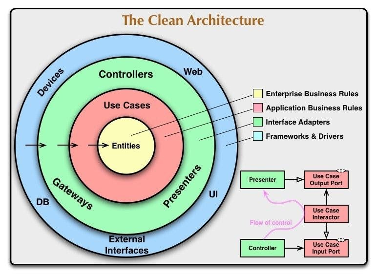
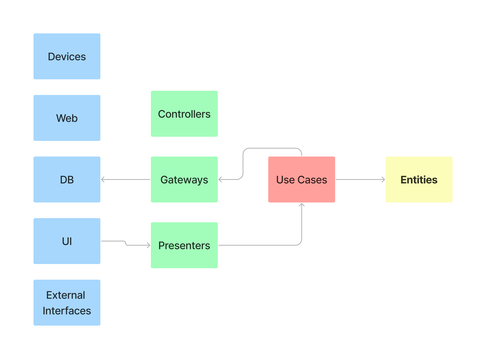
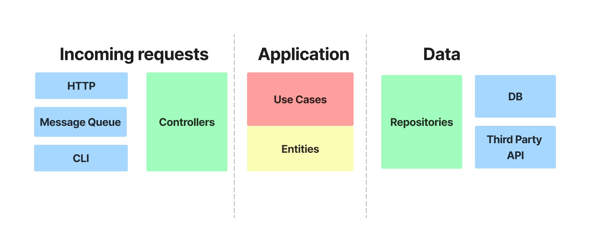
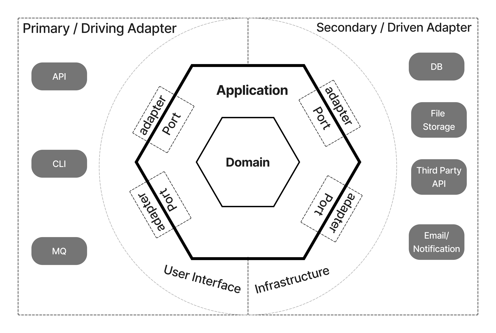
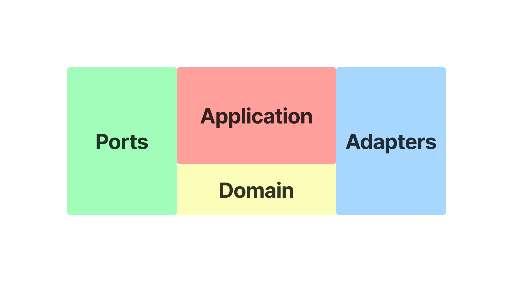
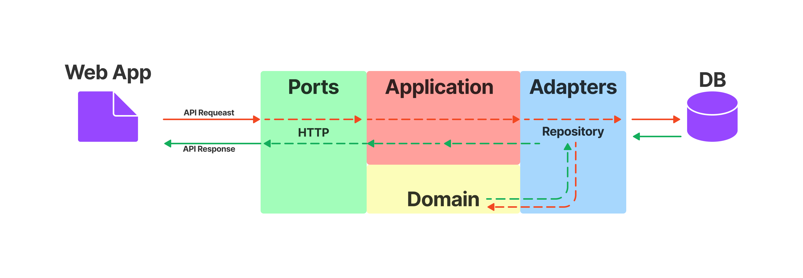

# The Clean Architecture Interpretation

I would like to tell you how we started to use the practice of code organization in our projects, what we reached and also show you an example how it looks like at our moment.

In the beginning our applications didn't have a clear structure, each developer organized the code as he preferred. It could be a flat structure with modules or one module with mixed code, there was no clear division of business logic and infrastructure things, this led to common pains. Tests were written reluctantly, new small changes had to be thought through in detail so that there were no unexpected consequences, the entry threshold for new developers increased.

In general, applications have performed well, but doing well does not mean that the application has a good code organization or architecture. The architecture is not about the functionality of the application, it's about the ease of change, deployment, independence, and speed of development.

### Code organization

Choosing an architecture is a very important moment in a project, especially when the application has already been written, and it doesn't have an architecture yet, in such a situation a lot of refactoring is inevitable. You could have chosen the architecture right away and organized the code correctly. This could have taken a lot of time and not get the results you wanted, or maybe the application will not be needed at all in the future, which will be a pity that a lot of effort was spent in the beginning.

When the question of choosing an architecture came up, we decided to try the Clean Architecture. Here are some reasons why we chose it:

- A colleague had experience and examples of its implementation
- The architecture has advantages that we lacked in our applications

We dived into studying all sorts of articles, blogs, different interpretations and implementations in different languages that we found the GitHub. We especially like the series of articles from [Three Dots Lab](https://threedots.tech/tags/clean-architecture/) where they showed refactoring a project by example. At first, we found it complicated and confusing, but practice and experimentation helped us understand the concept of architecture. The final result is not a canonical implementation of clean architecture, but a kind of compilation of different practices, and this result was influenced by the guys from Three Dots Lab.

So what is the Clean Architecture - this is a concept of code organization, proposed by Robert Martin, where the main principle is to divide a responsibility. An application divides into independent layers, which interact with each other in a certain way and transfer only those resources and data that are necessary to perform a task. This helps minimize the complexity of each layer, improves code readability and maintainability, reduces the probability of errors, and increases the speed of error handling. Like any architectural approach, the clear architecture alone does not keep you from writing some bad code, but it does make life easier if you follow its principles.

The article «[The Clean Architecture](https://blog.cleancoder.com/uncle-bob/2012/08/13/the-clean-architecture.html)», which is the original description of this approach, identifies 4 basic layers:

- **Entities**. Business logic is common to many applications.
- **Use Cases** (Interactors). Application logic.
- **Interface Adapters**. Adapters between Use Cases and the external world. This includes Presenters from MVPs as well as Gateways (more popularly called repositories).
- **Frameworks**. External layer, which contains: UI, database, http-client, etc.



In the diagram, the arrows point from the outside to the inside of the circle - this is the direction of the dependencies. Important: Dependencies are "directed" from outside to inside, not the other way around. In other words, a request called from the outer layers can call the inner layers, but the inner layers cannot call the outer layers. Each layer only knows about its neighbor and only as an interface. Data that intersect the layers must be in a simple structure or simply be arguments to a method call, and it must necessarily be in a form that is more convenient to the inner layer.

This diagram has one problem, it confuses many people and does not give an understanding of how the data flows between the layers, let's try to bring the diagram to a linear-block view.

Let's divide all the layers and layer elements into separate blocks, while keeping their color.



In this view it is easier to imagine the flow of data from an UI to a database. In this view it is easier to imagine the flow of data from an UI to a database. Then we remove unnecessary elements, split layers into categories and rename some elements to a more modern look, for example Gateways to Repositories, as this is a more common name for this entity, and UI is external requests that can come through API or message queue or manual commands from the console. We have 3 categories incoming requests, application, data.



This separation is already a reminder of Hexagonal Architecture, where there are 3 main parts primary adapter and secondary adapter and application.
The primary adapter is responsible for incoming requests, the secondary adapter communicates with the outside world, and the application focuses on business logic and the domain.



And also the main idea is to divide the code into parts and put the business logic in a separate entity.

But let's continue with our scheme. Reading this [article](https://threedots.tech/post/introducing-clean-architecture/), I liked how the guys called the layers, ports and adapters, but it's not the same as ports and adapters used in Hexagonal Architecture. Ports is the same as primary adapter or in our scheme incoming requests, basically all incoming messages to your application. Adapters are the same as secondary adapter or in our diagram it's called Data, this is how the application communicates with the outside world, for example the database, a file storage and so on.



As a result of all simplifications and renaming we get the following diagram. Ports and Adapters we already told you what they are, Application is the layer that connects all the other layers, it used to be called Use Cases and Domain is still unchanged, it keeps the business logic in itself.

Let's say we have a small web application to store a todo list of tasks, where we can get a list of tasks, create a task, edit and delete, basically a normal api. We need to get a list of tasks. To do this we make a call to our api, to get the list, the request goes to the port, because it is responsible for communicating with the outside world, then the port makes a request to the application to get the list, then the application makes a request to get the list in the repository, that we have adapters, repository then makes a request to the external repository, where the task list is stored. After receiving data repository transforms it to a domain object and sends it to the application, the application can do something with the object and sends it to the port and from the port the data goes to web application. In the diagram below I have shown the request path from web application to get data with red line and data path is shown with green line.



Now it's time to look at the code of the resulting architecture on a real example. We still have the same service to keep the todo list of tasks. This will be the simplest service for personal use.

```
.
├── api
│   ├── docs.go
│   ├── swagger.json
│   └── swagger.yaml
├── cmd
│   └── server
│       └── main.go
├── go.mod
├── go.sum
├── internal
│   ├── adapters
│   │   ├── repository
│   │   │   └── postgres.go
│   │   └── repository.go
│   ├── app
│   │   └── app.go
│   ├── domain
│   │   └── todo
│   │       ├── repository.go
│   │       └── task.go
│   ├── ports
│   │   └── http.go
│   └── service
│       └── application.go
├── make.sh
└── sql
    └── tasks

```

We use [Standard Go Project Layout](https://github.com/golang-standards/project-layout) to organize code in the repository. From the link above you can see what the root directories are for. In this example we are interested in the structure in the internal folder.
There are 5 folders: adapters, app, domain, ports, service.

- **adapters** - here we have various external api clients, pub/sub, database queries, everything we need to communicate with the outside world
- **ports** - responsible for receiving messages from the outside world, like http requests.
- **app** - is the application itself where the business logic is, where we connect the different layers, ports and adapters.
- **domain** - where the business logic and interfaces to receive data are placed
- **service** - this is an additional folder where interfaces to the app are stored

You can review the project code [here](example).

### Conclusions:

#### The advantage of this architecture:

1. Unbound code, separation of business logic from infrastructure things. Independence from external agents: the presence of abstractions between business logic and the external world in certain cases allows to change external sources without affecting internal layers.
2. Ease of testing - relatively easy to test code, which generally allows you to create a solid, quality and scalable product. layers are isolated, so they can be tested without monkey-patching
3. Ease of changing business rules, as they are all collected in one place, not spread across the project and not mixed up with low-level code;
4. A standard structure helps you navigate the project easily, speeding up development in the long run.

#### Disadvantages:

1. High entry threshold. It is quite difficult to think through the interaction of all the modules of the system, and for beginners this is an impossible task, and if a beginner has just entered the project with this architecture, everything looks confusing and does not serve any logic, without input data. In general, it's important to understand the basics of layers. From there, you'll already understand how to lay everything out, and you'll start doing it on automatic.
2. You have to write more code, especially mapping structures that move between layers.
3. interfaces, each layer has its own interfaces, yes this makes it easier to test, but it makes it harder to navigate.
